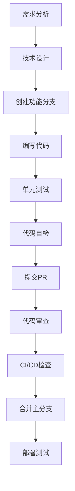

# AI Web自动化测试项目规则

## 📋 项目概述
本项目是一个基于AI的Web自动化测试系统，提供完整的WebUI界面用于测试用例管理、执行监控和结果分析。

## 🏗️ 架构规则

### 1. 分层架构原则
```
├── 表现层 (Presentation Layer)
│   ├── web_gui/templates/     # HTML模板
│   ├── web_gui/static/        # 静态资源
│   └── 前端JavaScript逻辑
├── 业务逻辑层 (Business Logic Layer)
│   ├── web_gui/app_enhanced.py # 主应用逻辑
│   ├── web_gui/api_routes.py   # API路由
│   └── 业务处理模块
├── 数据访问层 (Data Access Layer)
│   ├── web_gui/models.py       # 数据模型
│   └── 数据库操作
└── 基础设施层 (Infrastructure Layer)
    ├── midscene_python.py      # AI引擎接口
    ├── midscene_server.js      # MidScene服务
    └── 外部服务集成
```

### 2. 模块职责分离
- **单一职责原则**: 每个模块只负责一个明确的功能
- **依赖倒置**: 高层模块不依赖低层模块，都依赖抽象
- **接口隔离**: 使用清晰的接口定义模块间交互

## 📁 代码结构规则

### 1. 目录结构标准
```
AI-WebUIAuto/
├── web_gui/                   # Web界面核心模块
│   ├── templates/             # HTML模板文件
│   ├── static/               # 静态资源
│   │   ├── css/              # 样式文件
│   │   ├── js/               # JavaScript文件
│   │   └── screenshots/      # 截图文件
│   ├── app_enhanced.py       # 主应用入口
│   ├── api_routes.py         # API路由定义
│   ├── models.py             # 数据模型
│   └── run_enhanced.py       # 启动脚本
├── PRD/                      # 产品需求文档
├── TASK/                     # 任务文档
├── tests/                    # 测试文件
├── docs/                     # 项目文档
└── 配置文件
```

### 2. 文件命名规范
- **Python文件**: 使用下划线命名 `snake_case`
- **JavaScript文件**: 使用驼峰命名 `camelCase`
- **HTML模板**: 使用下划线命名 `template_name.html`
- **CSS文件**: 使用连字符命名 `style-name.css`
- **常量文件**: 全大写 `CONSTANTS.py`

### 3. 代码组织原则
- **相关功能聚合**: 相关的类和函数放在同一模块
- **公共代码提取**: 避免重复代码，提取公共函数
- **配置外部化**: 配置信息统一管理，不硬编码

## 💻 代码质量规则

### 1. Python代码规范
```python
# 文件头部注释模板
"""
模块名称: 模块功能简述
创建时间: YYYY-MM-DD
主要功能:
- 功能点1
- 功能点2
依赖模块: 列出主要依赖
"""

# 类定义规范
class TestCaseManager:
    """
    测试用例管理器
    
    负责测试用例的CRUD操作和业务逻辑处理
    
    Attributes:
        db_path (str): 数据库文件路径
        logger (Logger): 日志记录器
    """
    
    def __init__(self, db_path: str):
        """
        初始化测试用例管理器
        
        Args:
            db_path (str): 数据库文件路径
        """
        self.db_path = db_path
        self.logger = self._setup_logger()
    
    def create_testcase(self, name: str, steps: List[Dict]) -> int:
        """
        创建新的测试用例
        
        Args:
            name (str): 测试用例名称
            steps (List[Dict]): 测试步骤列表
            
        Returns:
            int: 新创建的测试用例ID
            
        Raises:
            ValueError: 当参数无效时抛出
            DatabaseError: 当数据库操作失败时抛出
        """
        pass
```

### 2. JavaScript代码规范
```javascript
/**
 * 执行控制台管理器
 * 负责测试执行的UI交互和状态管理
 */
class ExecutionConsole {
    /**
     * 构造函数
     * @param {string} containerId - 容器元素ID
     */
    constructor(containerId) {
        this.container = document.getElementById(containerId);
        this.socket = io();
        this.currentExecution = null;
        this.init();
    }
    
    /**
     * 开始执行测试用例
     * @param {number} testcaseId - 测试用例ID
     * @param {string} mode - 执行模式 ('browser' | 'headless')
     * @returns {Promise<void>}
     */
    async startExecution(testcaseId, mode) {
        // 实现逻辑
    }
}
```

### 3. HTML模板规范
```html
<!-- 文件头部注释 -->
<!--
模板名称: execution.html
功能描述: 测试执行控制台页面
创建时间: 2025-01-14
主要功能:
- 测试用例执行控制
- 实时状态显示
- 截图历史查看
-->

<!DOCTYPE html>
<html lang="zh-CN">
<head>
    <meta charset="UTF-8">
    <meta name="viewport" content="width=device-width, initial-scale=1.0">
    <title>执行控制台 - AI测试系统</title>
    <!-- 样式文件引入 -->
    <link rel="stylesheet" href="/static/css/common.css">
    <link rel="stylesheet" href="/static/css/execution.css">
</head>
<body>
    <!-- 页面结构清晰，使用语义化标签 -->
    <header class="page-header">
        <!-- 页面头部 -->
    </header>
    
    <main class="page-content">
        <!-- 主要内容 -->
    </main>
    
    <footer class="page-footer">
        <!-- 页面底部 -->
    </footer>
    
    <!-- JavaScript文件引入 -->
    <script src="/static/js/common.js"></script>
    <script src="/static/js/execution.js"></script>
</body>
</html>
```

## 📝 注释规范

### 1. 注释完备性要求
- **文件级注释**: 每个文件必须有头部注释说明功能
- **类级注释**: 每个类必须有详细的功能说明
- **函数级注释**: 每个函数必须有参数、返回值、异常说明
- **复杂逻辑注释**: 复杂的业务逻辑必须有行内注释

### 2. 注释质量标准
- **准确性**: 注释内容与代码实现一致
- **完整性**: 覆盖所有重要的功能点
- **清晰性**: 使用简洁明了的语言
- **及时性**: 代码修改时同步更新注释

## 🧹 代码库整洁规则

### 1. 版本控制规范
```bash
# 提交信息格式
<type>(<scope>): <subject>

# 类型说明
feat:     新功能
fix:      修复bug
docs:     文档更新
style:    代码格式调整
refactor: 代码重构
test:     测试相关
chore:    构建过程或辅助工具变动

# 示例
feat(webui): 添加截图历史功能
fix(api): 修复测试用例删除接口错误
docs(readme): 更新安装说明
```

### 2. 文件管理规范
- **临时文件清理**: 不提交临时文件、日志文件、缓存文件
- **敏感信息保护**: API密钥等敏感信息使用环境变量
- **依赖管理**: 及时更新requirements.txt和package.json
- **文档同步**: 代码变更时同步更新相关文档

### 3. 代码审查标准
- **功能正确性**: 代码实现符合需求
- **性能考虑**: 避免明显的性能问题
- **安全性检查**: 防止常见的安全漏洞
- **可维护性**: 代码易于理解和修改

## 🔧 开发工具配置

### 1. 代码格式化
```python
# .flake8 配置
[flake8]
max-line-length = 88
exclude = node_modules,migrations
ignore = E203,W503

# black 配置
[tool.black]
line-length = 88
target-version = ['py38']
```

### 2. 编辑器配置
```json
// .vscode/settings.json
{
    "python.formatting.provider": "black",
    "python.linting.enabled": true,
    "python.linting.flake8Enabled": true,
    "editor.formatOnSave": true,
    "files.trimTrailingWhitespace": true
}
```

## 📊 质量监控

### 1. 代码质量指标
- **代码覆盖率**: 测试覆盖率 > 80%
- **复杂度控制**: 函数圈复杂度 < 10
- **重复代码**: 重复代码率 < 5%
- **文档覆盖**: 公共API文档覆盖率 100%

### 2. 持续集成检查
- **语法检查**: 代码语法正确性
- **格式检查**: 代码格式符合规范
- **测试执行**: 所有测试用例通过
- **安全扫描**: 依赖包安全性检查

## 🎯 执行监督

### 1. 代码审查流程
1. **自检**: 开发者提交前自我检查
2. **同行审查**: 至少一人代码审查
3. **自动检查**: CI/CD自动化检查
4. **合并审批**: 通过所有检查后合并

### 2. 违规处理
- **警告**: 轻微违规给予提醒
- **修改要求**: 严重违规要求修改
- **培训**: 反复违规进行培训
- **流程改进**: 根据问题改进规则

## 🚀 具体实施指南

### 1. 新功能开发流程


### 2. 错误处理标准
```python
# 统一错误处理模式
class APIError(Exception):
    """API错误基类"""
    def __init__(self, message: str, code: int = 500):
        self.message = message
        self.code = code
        super().__init__(self.message)

class ValidationError(APIError):
    """参数验证错误"""
    def __init__(self, message: str):
        super().__init__(message, 400)

# 错误处理装饰器
def handle_errors(func):
    """统一错误处理装饰器"""
    def wrapper(*args, **kwargs):
        try:
            return func(*args, **kwargs)
        except ValidationError as e:
            return {"error": e.message, "code": e.code}, e.code
        except Exception as e:
            logger.error(f"Unexpected error: {e}")
            return {"error": "Internal server error", "code": 500}, 500
    return wrapper
```

### 3. 日志记录规范
```python
import logging
import sys
from datetime import datetime

# 日志配置标准
def setup_logger(name: str, level: str = "INFO") -> logging.Logger:
    """
    设置标准日志记录器

    Args:
        name (str): 日志记录器名称
        level (str): 日志级别

    Returns:
        logging.Logger: 配置好的日志记录器
    """
    logger = logging.getLogger(name)
    logger.setLevel(getattr(logging, level.upper()))

    # 控制台处理器
    console_handler = logging.StreamHandler(sys.stdout)
    console_handler.setLevel(logging.INFO)

    # 文件处理器
    file_handler = logging.FileHandler(
        f"logs/{name}_{datetime.now().strftime('%Y%m%d')}.log"
    )
    file_handler.setLevel(logging.DEBUG)

    # 格式化器
    formatter = logging.Formatter(
        '%(asctime)s - %(name)s - %(levelname)s - %(message)s'
    )
    console_handler.setFormatter(formatter)
    file_handler.setFormatter(formatter)

    logger.addHandler(console_handler)
    logger.addHandler(file_handler)

    return logger

# 日志使用示例
logger = setup_logger(__name__)

def execute_test_case(testcase_id: int):
    """执行测试用例"""
    logger.info(f"开始执行测试用例: {testcase_id}")
    try:
        # 执行逻辑
        logger.debug(f"测试用例 {testcase_id} 执行详情...")
        logger.info(f"测试用例 {testcase_id} 执行成功")
    except Exception as e:
        logger.error(f"测试用例 {testcase_id} 执行失败: {e}")
        raise
```

### 4. 配置管理规范
```python
# config.py - 配置管理
import os
from typing import Optional

class Config:
    """应用配置类"""

    # 数据库配置
    DATABASE_URL: str = os.getenv('DATABASE_URL', 'sqlite:///app.db')

    # AI服务配置
    OPENAI_API_KEY: str = os.getenv('OPENAI_API_KEY', '')
    OPENAI_BASE_URL: str = os.getenv('OPENAI_BASE_URL', '')
    MIDSCENE_MODEL_NAME: str = os.getenv('MIDSCENE_MODEL_NAME', 'qwen-vl-max-latest')

    # 应用配置
    DEBUG: bool = os.getenv('DEBUG', 'False').lower() == 'true'
    SECRET_KEY: str = os.getenv('SECRET_KEY', 'dev-secret-key')

    # 文件路径配置
    SCREENSHOT_DIR: str = os.getenv('SCREENSHOT_DIR', 'web_gui/static/screenshots')
    LOG_DIR: str = os.getenv('LOG_DIR', 'logs')

    @classmethod
    def validate(cls) -> None:
        """验证配置完整性"""
        required_configs = ['OPENAI_API_KEY', 'OPENAI_BASE_URL']
        missing_configs = [
            config for config in required_configs
            if not getattr(cls, config)
        ]

        if missing_configs:
            raise ValueError(f"缺少必要配置: {', '.join(missing_configs)}")

# 环境变量模板 (.env.example)
"""
# AI服务配置
OPENAI_API_KEY=your_api_key_here
OPENAI_BASE_URL=https://dashscope.aliyuncs.com/compatible-mode/v1
MIDSCENE_MODEL_NAME=qwen-vl-max-latest
MIDSCENE_USE_QWEN_VL=1

# 应用配置
DEBUG=false
SECRET_KEY=your_secret_key_here

# 数据库配置
DATABASE_URL=sqlite:///app.db

# 文件路径配置
SCREENSHOT_DIR=web_gui/static/screenshots
LOG_DIR=logs
"""
```

### 5. 测试规范
```python
# test_example.py - 测试示例
import unittest
from unittest.mock import Mock, patch
from web_gui.models import TestCase
from web_gui.app_enhanced import app

class TestCaseModelTest(unittest.TestCase):
    """测试用例模型测试"""

    def setUp(self):
        """测试前置设置"""
        self.app = app.test_client()
        self.app.testing = True

    def test_create_testcase_success(self):
        """测试创建测试用例成功场景"""
        # Given
        testcase_data = {
            "name": "测试用例1",
            "description": "测试描述",
            "steps": [{"action": "navigate", "params": {"url": "https://baidu.com"}}]
        }

        # When
        response = self.app.post('/api/v1/testcases', json=testcase_data)

        # Then
        self.assertEqual(response.status_code, 201)
        data = response.get_json()
        self.assertIn('id', data)
        self.assertEqual(data['name'], testcase_data['name'])

    def test_create_testcase_validation_error(self):
        """测试创建测试用例参数验证错误"""
        # Given
        invalid_data = {"name": ""}  # 缺少必要字段

        # When
        response = self.app.post('/api/v1/testcases', json=invalid_data)

        # Then
        self.assertEqual(response.status_code, 400)
        data = response.get_json()
        self.assertIn('error', data)

    @patch('web_gui.models.TestCase.execute')
    def test_execute_testcase_mock(self, mock_execute):
        """测试执行测试用例（使用Mock）"""
        # Given
        mock_execute.return_value = {"success": True, "steps": []}

        # When
        response = self.app.post('/api/v1/testcases/1/execute')

        # Then
        self.assertEqual(response.status_code, 200)
        mock_execute.assert_called_once()

if __name__ == '__main__':
    unittest.main()
```

## 📋 检查清单

### 代码提交前检查清单
- [ ] 代码符合PEP8规范（Python）或ESLint规范（JavaScript）
- [ ] 所有函数和类都有完整的文档字符串
- [ ] 复杂逻辑有适当的行内注释
- [ ] 没有硬编码的配置信息
- [ ] 错误处理完整且统一
- [ ] 日志记录适当且有意义
- [ ] 单元测试覆盖新增功能
- [ ] 没有明显的性能问题
- [ ] 安全性考虑（输入验证、SQL注入防护等）
- [ ] 提交信息格式正确且描述清晰

### 代码审查检查清单
- [ ] 功能实现正确且完整
- [ ] 代码逻辑清晰易懂
- [ ] 架构设计合理
- [ ] 性能考虑充分
- [ ] 安全性检查通过
- [ ] 测试覆盖充分
- [ ] 文档更新及时
- [ ] 向后兼容性考虑

---

**规则版本**: v1.0
**生效日期**: 2025-01-14
**更新周期**: 每季度评估更新
**维护责任人**: 项目负责人
**执行监督**: 全体开发人员
