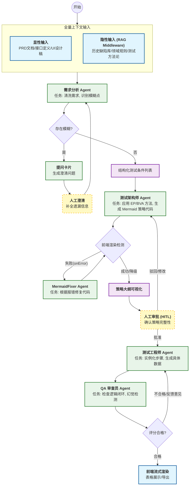

```markdown
# 智能测试用例生成 Agent (TestGen-Agent) 产品需求与技术设计文档

| 文档版本 | v1.3 (综合整合版) |
| :--- | :--- |
| **产品名称** | TestGen-Agent (智能测试生成助手) |
| **核心目标** | 辅助一线测试人员将需求转化为全面、可视化的测试策略与用例，实现从“小时级”到“分钟级”的提效。 |
| **技术架构** | LangChain v1 + LangGraph (Stateful Multi-Agent) |
| **文档用途** | 指导代码开发、系统架构搭建及功能实现 |

---

## 1. 产品背景与价值主张

### 1.1 背景
传统的测试用例设计高度依赖人工经验，面临三大痛点：
1.  **效率低**：从阅读需求到产出用例耗时极长。
2.  **覆盖率不稳**：容易遗漏隐性需求和边界条件（如由疲劳或经验不足导致）。
3.  **文档割裂**：需求文档与测试用例之间缺乏直观的逻辑连接，修改成本高。

### 1.2 价值主张
本产品不是要替代测试人员，而是赋予其**“架构师级”**的分析能力：
*   **深度洞察**：通过内嵌的 BVA/EP 方法论，自动识别边界值与异常场景。
*   **可视化思维**：将晦涩的文字需求转化为 Mermaid 流程图/脑图，辅助通过视觉进行逻辑对齐。
*   **人机协同**：通过“策略对齐”环节，让测试人员在生成海量步骤前先确认测试方向，避免返工。

---

## 2. 用户角色 (User Personas)

| 角色 | 职责描述 | 核心痛点解决 |
| :--- | :--- | :--- |
| **测试工程师 (Tester)**<br>*(核心用户)* | 1. **投喂需求**：上传文档或粘贴文本。<br>2. **策略对齐**：查看 Agent 生成的思维导图/策略，进行确认或调整。<br>3. **结果验收**：审查生成的用例，导出结果。 | 减少编写重复步骤的体力劳动；<br>利用可视化图表快速理解复杂逻辑。 |
| **管理员 (Admin)** | 1. **知识库维护**：上传历史 Bug 库、领域术语表（用于 RAG）。<br>2. **模型配置**：配置 LLM 参数和 Prompt 模板。 | 确保 Agent 掌握特定业务领域的“隐性知识”。 |

---

## 3. 系统架构与工作流 (System Architecture)

### 3.1 核心架构理念
本系统基于 **LangChain v1** 标准与 **LangGraph** 编排引擎构建。
*   **架构模式**：采用 **接力模式（Handoff Pattern）** 与 **反思循环（Reflexion）** 相结合。
*   **状态管理**：基于 **Pydantic** 的强类型状态流转，具备持久化记忆。
*   **自愈机制**：针对可视化生成包含显式的“Mermaid 语法修复环路”。

### 3.2 完整工作流图 (Mermaid Workflow)



---

## 4. 全局状态定义 (State Schema)

为了支持核心逻辑及自愈修复功能，需合并业务状态与技术状态。

```python
from typing import List, Optional, Annotated
from typing_extensions import TypedDict
from pydantic import BaseModel, Field
from langgraph.graph.message import add_messages

# 1. 原子化测试用例结构
class TestCase(BaseModel):
    id: str
    title: str = Field(description="简明扼要的标题")
    priority: str = Field(description="P0-冒烟, P1-核心, P2-次要")
    pre_condition: str = Field(description="前置条件，不包含操作步骤")
    steps: List[str] = Field(description="原子化操作步骤列表")
    test_data: str = Field(description="具体的测试数据，如'金额: 100.00'")
    expected_result: str = Field(description="明确的系统响应，含错误码或UI变化")
    design_method: str = Field(description="使用的设计方法，如'边界值分析-最大值'")

# 2. 全局状态 (State)
class AgentState(TypedDict):
    # --- 基础记忆 ---
    messages: Annotated[List, add_messages] # 自动追加对话历史
    
    # --- 输入上下文 ---
    raw_requirements: str        # 原始需求文本
    api_specs: Optional[str]     # Swagger/API 定义
    historical_bugs: List[str]   # RAG 检索到的相关历史 Bug
    
    # --- 业务流程控制 ---
    clarification_needed: bool   # 是否需要人工澄清需求
    test_strategy_plan: str      # 架构师生成的策略大纲文本
    strategy_approved: bool      # 策略是否已获人工批准
    
    # --- 可视化渲染与修复 (Mermaid Fix Loop) ---
    mermaid_code: str            # 当前生成的 Mermaid 代码
    render_error: Optional[str]  # 前端反馈的错误信息
    retry_count: int             # 渲染修复重试计数器
    
    # --- 最终产物 ---
    generated_cases: List[TestCase] # 结构化用例列表
    review_feedback: str         # QA 的审查意见
```

---

## 5. 功能模块与技术实现 (Functional & Technical Specs)

### 5.1 需求摄入与 RAG 增强
*   **功能需求**：支持文本/文件输入；自动检索历史缺陷。
*   **技术实现 (RAG Middleware)**：
    *   利用 LangChain v1 的 `create_agent` 中间件特性。
    *   编写自定义 `Before_Agent` Hook：在 Agent 开始思考前，自动根据需求关键词查询向量数据库，将提取的“历史缺陷 Top 5”注入 System Prompt。
    *   **角色 Prompt (需求分析)**：要求结合检索到的 Bug，提示本次需求可能的风险点。

### 5.2 策略规划与可视化自愈 (Strategy & Visualization)
*   **功能需求**：产出策略而非直接产出用例；支持 Mermaid 脑图渲染；若渲染失败需自动修复。
*   **角色 Prompt (测试架构师)**：
    *   必须显式应用方法论：**EP (等价类)**、**BVA (边界值 Min-1/Max+1)**、**场景法**。
*   **技术实现 (Mermaid 修复环路)**：
    1.  **前端侦测**：前端组件（如 `react-mermaid`）捕获 `onError` 事件，将错误信息回传后端。
    2.  **MermaidFixer 节点**：
        *   **System Prompt**：你是一个 Mermaid 语法修复专家。根据报错信息修复错误的 Mermaid 代码。重点检查节点 ID 特殊字符、括号转义。
    3.  **路由逻辑 (Python)**：
        ```python
        def route_render_check(state: AgentState):
            if state["retry_count"] > 3:
                return "__end__" # 降级显示原始代码
            if state["render_error"]:
                return "mermaid_fixer_node" # 进入修复节点
            return "human_alignment_node" # 继续
        ```

### 5.3 人机对齐 (Human-in-the-Loop)
*   **功能需求**：在策略展示后自动暂停，支持用户确认或修改。
*   **技术实现 (Persistence)**：
    *   使用 `PostgresSaver` 保存会话状态 (Checkpoint)。
    *   LangGraph 配置：`interrupt_before=["test_case_generation_node"]`。
    *   恢复逻辑：前端点击批准后，调用 `app.stream(..., command="resume")`。

### 5.4 用例生成与 QA 审查
*   **功能需求**：生成结构化用例；后台自动 QA 检查。
*   **角色 Prompt (测试工程师)**：
    *   **数据实例化**：禁止模糊描述（如“输入有效数据”），必须生成具体数据。
    *   **格式化**：严格遵循 `TestCase` Pydantic 结构。
*   **角色 Prompt (QA 审查员)**：
    *   执行 **Reflexion** 循环。检查覆盖率（是否遗漏边界点）、幻觉检测（引用不存在的 UI）、逻辑闭环。
    *   路由逻辑：评分 < 4 分 -> 路由回“测试工程师”重写。

### 5.5 输出与交互
*   **功能需求**：流式渲染，HTML 表格展示，支持导出。
*   **技术实现**：
    *   使用 `stream_mode="messages"` 或 `updates` 实现打字机效果。
    *   前端分屏设计：左侧 Chat，右侧 Live Rendering Canvas。

---

## 6. 非功能性需求 (NFRs)

*   **交互体验**：策略图流式首字响应 (TTFT) < 3秒。右侧 Canvas 区域动态展示图表，确保信息不被对话流冲走。
*   **数据安全**：集成 **PII Middleware**，在发送给 LLM 前自动掩盖手机号、身份证等敏感信息。
*   **鲁棒性**：
    *   **状态持久化**：用户关闭浏览器后，重新打开应能恢复之前的策略图状态。
    *   **渲染降级**：若 Mermaid 修复 3 次仍失败，自动降级显示原始代码块。

---

## 7. 验收标准 (Success Metrics)

1.  **可视化成功率**：Agent 输出的 Mermaid 代码经自动修复后，能被前端成功渲染的比例 > 95%。
2.  **对齐有效性**：用户在“策略对齐”阶段进行干预后，生成的最终用例包含了用户补充点的比例（验证 Context 记忆）。
3.  **可用性**：生成的用例无需修改或仅需微调即可直接使用的比例 > 80%。

---

## 8. 开发路线图 (Roadmap)

*   **Phase 1 (MVP)**:
    *   实现文本/文件输入。
    *   搭建 LangGraph 核心流：分析 -> 策略 -> 生成。
    *   **核心攻坚**：实现 Mermaid 的流式输出与“侦测-修复”环路。
    *   支持 Excel 导出。
*   **Phase 2 (Enhancement)**:
    *   引入 RAG (历史缺陷库) 中间件。
    *   实现 QA 自动审查节点 (Reflexion)。
    *   前端表格支持在线编辑。
*   **Phase 3 (Integration)**:
    *   (未来规划) DevOps 平台集成。
    *   (未来规划) 画布支持拖拽编辑节点直接修改 Agent 记忆。
```