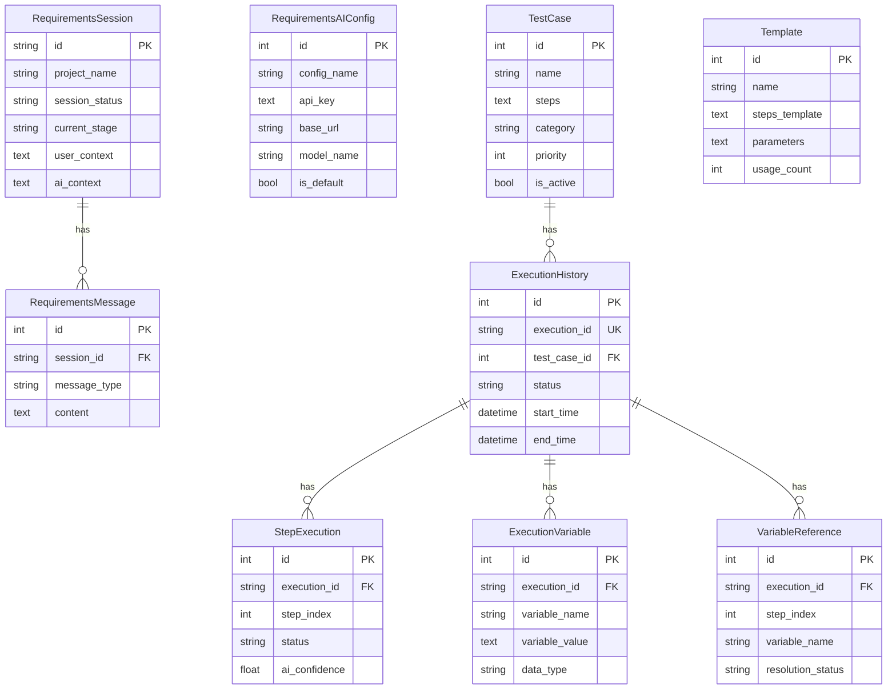

# 数据模型文档

> **生成日期**: 2025-12-30
> **来源**: 穷尽代码扫描

---

## AI 智能体模块 (`tools/ai-agents`)

### RequirementsSession - 需求分析会话

**表名**: `requirements_sessions`

| 字段 | 类型 | 约束 | 说明 |
|---|---|---|---|
| `id` | String(50) | PK | UUID 格式会话 ID |
| `project_name` | String(255) | - | 项目名称 |
| `session_status` | String(50) | default='active' | 状态: active, paused, completed, archived |
| `current_stage` | String(50) | default='initial' | 阶段: initial, clarification, consensus, documentation |
| `user_context` | Text | - | JSON 字符串 - 用户上下文 |
| `ai_context` | Text | - | JSON 字符串 - AI 分析上下文 |
| `consensus_content` | Text | - | JSON 字符串 - 达成共识的需求内容 |
| `created_at` | DateTime | default=now | 创建时间 |
| `updated_at` | DateTime | auto_update | 更新时间 |

**索引**:
- `idx_requirements_session_status` (session_status)
- `idx_requirements_session_stage` (current_stage)
- `idx_requirements_session_created` (created_at)
- `idx_requirements_session_updated` (updated_at)

**关系**:
- `messages` → RequirementsMessage (一对多)

---

### RequirementsMessage - 需求分析消息

**表名**: `requirements_messages`

| 字段 | 类型 | 约束 | 说明 |
|---|---|---|---|
| `id` | Integer | PK, auto | 消息 ID |
| `session_id` | String(50) | FK, NOT NULL | 关联会话 ID |
| `message_type` | String(20) | NOT NULL | 类型: user, assistant, system |
| `content` | Text | NOT NULL | 消息内容 |
| `message_metadata` | Text | - | JSON 字符串 - 消息元数据 |
| `attached_files` | Text | - | JSON 字符串 - 附件信息 |
| `created_at` | DateTime | default=now | 创建时间 |

**索引**:
- `idx_requirements_message_session` (session_id, created_at)
- `idx_requirements_message_type` (session_id, message_type)
- `idx_requirements_message_created` (created_at)

---

### RequirementsAIConfig - AI 配置

**表名**: `requirements_ai_configs`

| 字段 | 类型 | 约束 | 说明 |
|---|---|---|---|
| `id` | Integer | PK, auto | 配置 ID |
| `config_name` | String(255) | NOT NULL | 用户自定义配置名称 |
| `api_key` | Text | NOT NULL | API 密钥 (脱敏存储) |
| `base_url` | String(500) | NOT NULL | API 基础 URL |
| `model_name` | String(100) | NOT NULL | 模型名称 |
| `is_default` | Boolean | default=False | 是否为默认配置 |
| `is_active` | Boolean | default=True | 是否启用 |
| `created_at` | DateTime | default=now | 创建时间 |
| `updated_at` | DateTime | auto_update | 更新时间 |

---

## 意图测试工具模块 (`tools/intent-tester`)

### TestCase - 测试用例

**表名**: `test_cases`

| 字段 | 类型 | 约束 | 说明 |
|---|---|---|---|
| `id` | Integer | PK, auto | 测试用例 ID |
| `name` | String(255) | NOT NULL | 用例名称 |
| `description` | Text | - | 用例描述 |
| `steps` | Text | NOT NULL | JSON 字符串 - 测试步骤数组 |
| `tags` | String(500) | - | 逗号分隔的标签 |
| `category` | String(100) | - | 分类 |
| `priority` | Integer | default=3 | 优先级 (1-5) |
| `created_by` | String(100) | - | 创建者 |
| `created_at` | DateTime | default=now | 创建时间 |
| `updated_at` | DateTime | auto_update | 更新时间 |
| `is_active` | Boolean | default=True | 是否启用 (软删除标志) |

**索引**:
- `idx_testcase_active` (is_active)
- `idx_testcase_category` (category, is_active)
- `idx_testcase_created` (created_at)
- `idx_testcase_priority` (priority, is_active)

**关系**:
- `executions` → ExecutionHistory (一对多)

---

### ExecutionHistory - 执行历史

**表名**: `execution_history`

| 字段 | 类型 | 约束 | 说明 |
|---|---|---|---|
| `id` | Integer | PK, auto | 记录 ID |
| `execution_id` | String(50) | UNIQUE, NOT NULL | 执行唯一标识 |
| `test_case_id` | Integer | FK, NOT NULL | 关联测试用例 |
| `status` | String(50) | NOT NULL | 状态: running, success, failed, stopped |
| `mode` | String(20) | default='headless' | 模式: browser, headless |
| `browser` | String(50) | default='chrome' | 浏览器类型 |
| `start_time` | DateTime | NOT NULL | 开始时间 |
| `end_time` | DateTime | - | 结束时间 |
| `duration` | Integer | - | 执行时长 (秒) |
| `steps_total` | Integer | - | 总步骤数 |
| `steps_passed` | Integer | - | 通过步骤数 |
| `steps_failed` | Integer | - | 失败步骤数 |
| `result_summary` | Text | - | JSON 字符串 - 结果摘要 |
| `screenshots_path` | Text | - | 截图路径 |
| `logs_path` | Text | - | 日志路径 |
| `error_message` | Text | - | 错误信息 |
| `error_stack` | Text | - | 错误堆栈 |
| `executed_by` | String(100) | - | 执行者 |
| `created_at` | DateTime | default=now | 创建时间 |

**索引**:
- `idx_execution_testcase_status` (test_case_id, status)
- `idx_execution_start_time` (start_time)
- `idx_execution_status` (status)
- `idx_execution_executed_by` (executed_by)
- `idx_execution_created_at` (created_at)

**关系**:
- `test_case` → TestCase (多对一)
- `step_executions` → StepExecution (一对多)
- `variables` → ExecutionVariable (一对多)
- `variable_references` → VariableReference (一对多)

---

### StepExecution - 步骤执行详情

**表名**: `step_executions`

| 字段 | 类型 | 约束 | 说明 |
|---|---|---|---|
| `id` | Integer | PK, auto | 记录 ID |
| `execution_id` | String(50) | FK, NOT NULL | 关联执行 ID |
| `step_index` | Integer | NOT NULL | 步骤索引 |
| `step_description` | Text | NOT NULL | 步骤描述 |
| `status` | String(20) | NOT NULL | 状态: success, failed, skipped |
| `start_time` | DateTime | NOT NULL | 开始时间 |
| `end_time` | DateTime | - | 结束时间 |
| `duration` | Integer | - | 执行时长 (毫秒) |
| `screenshot_path` | Text | - | 截图路径 |
| `ai_confidence` | Float | - | AI 置信度 |
| `ai_decision` | Text | - | JSON 字符串 - AI 决策详情 |
| `error_message` | Text | - | 错误信息 |

**索引**:
- `idx_step_execution_id_index` (execution_id, step_index)
- `idx_step_status` (execution_id, status)
- `idx_step_start_time` (start_time)

---

### Template - 测试模板

**表名**: `templates`

| 字段 | 类型 | 约束 | 说明 |
|---|---|---|---|
| `id` | Integer | PK, auto | 模板 ID |
| `name` | String(255) | NOT NULL | 模板名称 |
| `description` | Text | - | 模板描述 |
| `category` | String(100) | - | 分类 |
| `steps_template` | Text | NOT NULL | JSON 字符串 - 步骤模板 |
| `parameters` | Text | - | JSON 字符串 - 模板参数定义 |
| `usage_count` | Integer | default=0 | 使用次数 |
| `created_by` | String(100) | - | 创建者 |
| `created_at` | DateTime | default=now | 创建时间 |
| `is_public` | Boolean | default=False | 是否公开 |

---

### ExecutionVariable - 执行变量

**表名**: `execution_variables`

| 字段 | 类型 | 约束 | 说明 |
|---|---|---|---|
| `id` | Integer | PK, auto | 记录 ID |
| `execution_id` | String(50) | FK, NOT NULL | 关联执行 ID |
| `variable_name` | String(255) | NOT NULL | 变量名 |
| `variable_value` | Text | - | JSON 字符串 - 变量值 |
| `data_type` | String(50) | NOT NULL | 类型: string, number, boolean, object, array |
| `source_step_index` | Integer | NOT NULL | 来源步骤索引 |
| `source_api_method` | String(100) | - | 来源 API 方法 (aiQuery, aiString 等) |
| `source_api_params` | Text | - | JSON 字符串 - API 参数 |
| `created_at` | DateTime | default=now | 创建时间 |
| `is_encrypted` | Boolean | default=False | 是否加密存储 |

**索引**:
- `idx_execution_variable` (execution_id, variable_name)
- `idx_execution_step` (execution_id, source_step_index)
- `idx_variable_type` (execution_id, data_type)

**唯一约束**:
- `uk_execution_variable_name` (execution_id, variable_name)

---

### VariableReference - 变量引用

**表名**: `variable_references`

| 字段 | 类型 | 约束 | 说明 |
|---|---|---|---|
| `id` | Integer | PK, auto | 记录 ID |
| `execution_id` | String(50) | FK, NOT NULL | 关联执行 ID |
| `step_index` | Integer | NOT NULL | 使用变量的步骤 |
| `variable_name` | String(255) | NOT NULL | 引用的变量名 |
| `reference_path` | String(500) | - | 引用路径 (如 product_info.price) |
| `parameter_name` | String(255) | - | 使用变量的参数名 |
| `original_expression` | String(500) | - | 原始引用表达式 ${product_info.price} |
| `resolved_value` | Text | - | 解析后的值 |
| `resolution_status` | String(20) | default='success' | 状态: success, failed, pending |
| `error_message` | Text | - | 解析错误信息 |
| `created_at` | DateTime | default=now | 创建时间 |

**索引**:
- `idx_reference_execution_step` (execution_id, step_index)
- `idx_reference_variable` (execution_id, variable_name)
- `idx_reference_status` (execution_id, resolution_status)

---

## 实体关系图

